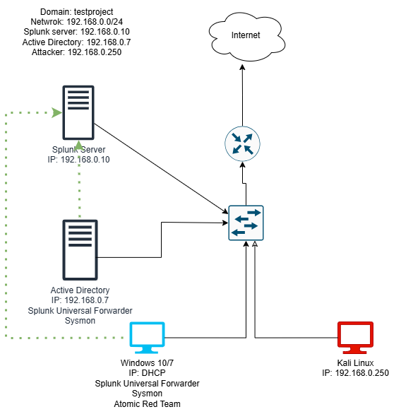

# Active Directory Project

A fully functional Active Directory lab environment built and configured for cybersecurity learning, monitoring, and attack simulation, inspired by [MyDFIR's YouTube series](https://www.youtube.com/@MyDFIR). This hands-on project was designed to emulate a realistic enterprise setup and enhance blue team skills using open-source tools and virtual machines.

---

## 📌 Project Overview

This project simulates a small corporate environment with:
- A **Windows Server 2022** domain controller (Active Directory)
- A **Windows 10** client machine joined to the domain
- An **Ubuntu Server** running Splunk for log aggregation and SIEM
- A **Kali Linux** machine to simulate red team activity

The lab was built entirely using **VirtualBox** and configured to operate on a **NAT network** (`192.168.0.0/24`).

---

##  Tools and Technologies

| Technology     | Purpose                              |
|----------------|--------------------------------------|
| Windows Server | Active Directory Domain Services     |
| Windows 10     | Domain-joined endpoint               |
| Kali Linux     | Adversary simulation (Crowbar, etc.) |
| Ubuntu Server  | Splunk instance (log collection)     |
| Sysmon         | Windows event monitoring             |
| Splunk         | SIEM/log analysis                    |
| PowerShell     | Automation and configuration         |
| Atomic Red Team| Attack simulation framework          |

---

##  Key Features & Skills Practiced

-  Domain Controller configuration and domain join
-  Group Policy setup and account management
-  Installation and configuration of Splunk & Sysmon
-  Log ingestion and dashboard creation in Splunk
-  Simulated brute-force and attack detection
-  PowerShell scripting for system tasks
-  Network segmentation and routing in VirtualBox

---

##  What I Learned

- Configuring a secure, isolated AD lab using virtual machines
- Monitoring and analyzing security events with SIEM tools
- Understanding attacker behavior through red team simulations
- Creating and tuning logging pipelines using Sysmon + Splunk
- Investigating attacks using Windows Event Logs and Splunk queries

---

##  Screenshots

Here are some visuals from the lab environment:

- 
- 
- 
- 

These screenshots demonstrate domain setup, log ingestion, and simulated attack detection.

---
